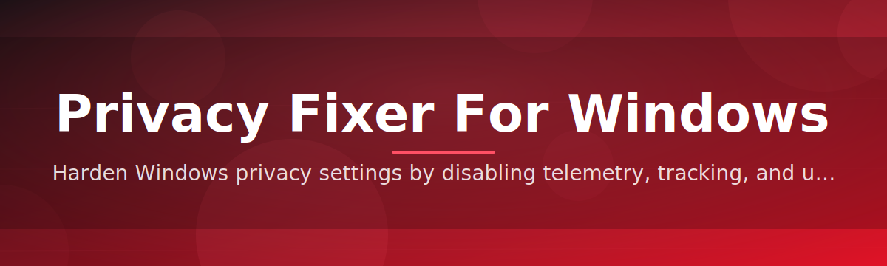

# windows-privacy-optimizer

Harden Windows privacy settings by disabling telemetry, tracking, and unwanted data collection

  

## Overview

Harden Windows privacy settings by disabling telemetry, tracking, and unwanted data collection

## License

[MIT License](LICENSE)
